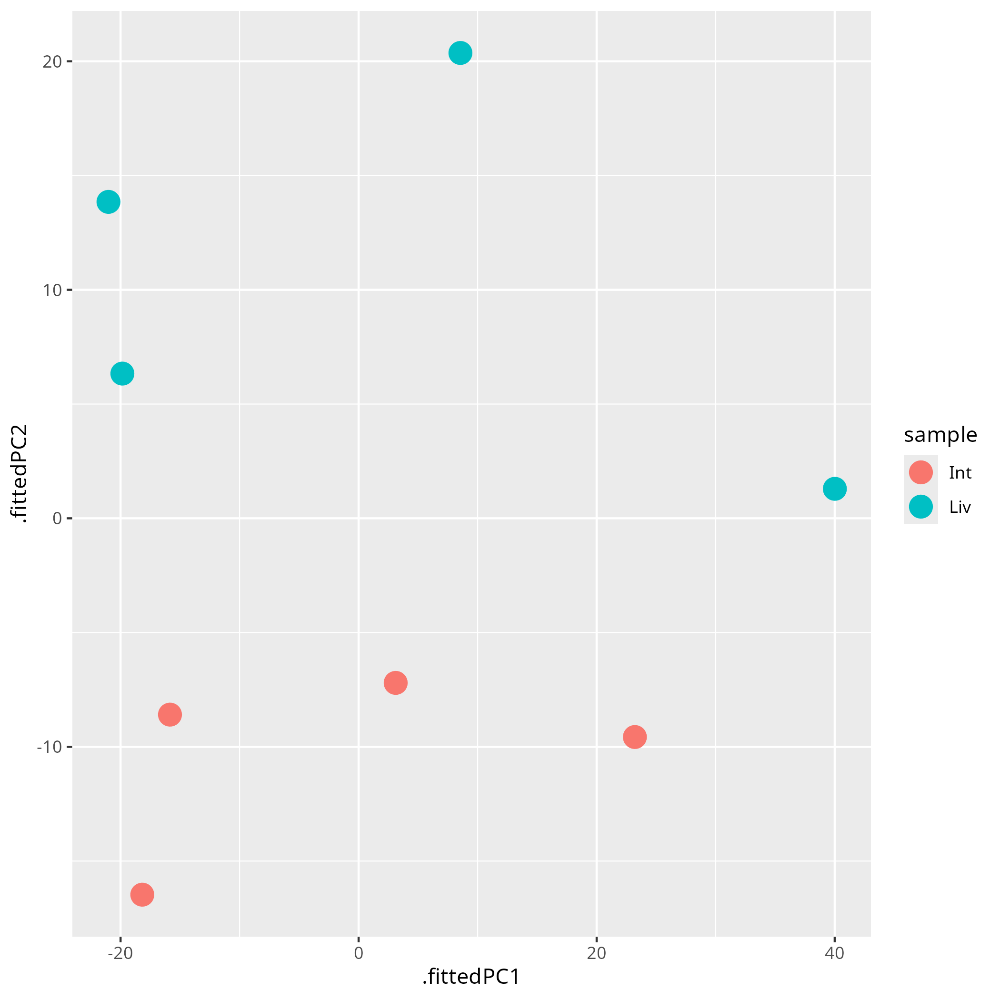

 
This is a distribution plot of our samples using the hisat alignment method before noramlization. There are not any clearly visable patterns. 
 
 
 
This is a pca plot of our samples using the hisat alignment method before normalization. There is clear separation between the samples from the liver and intestines. This means the pca after normalization should look good as well. 
 
 
 
This is a pca plot of our samples using the hisat alignment method after normalization with DESeq2. There is clear clustering of the samples from the liver and from the intestines. This leads me to believe that there is a signifficant different between miracidia from the liver and intestines. 
 
 
 
This is a volcano plot of our samples using the hisat alignment method after normalization with DESeq2. Most genes had a padj value of 0. This could be due to using from the reduced dataset rather than the whole dataset as there is less variation. 
 
 
 
This is a distribution plot of our samples using the star alignment method before noramlization. There are not any clearly visable patterns. 
 
 
 
This is a pca plot of our samples using the star alignment method before normalization. There is clear separation between the samples from the liver and intestines. This means the pca after normalization should look good as well. 
 
 
 
This is a pca plot of our samples using the star alignment method after normalization with DESeq2. There is clear clustering of the samples from the liver and from the intestines. This leads me to believe that there is a signifficant different between miracidia from the liver and intestines. 
 
 
 
This is a volcano plot of our samples using the star alignment method after normalization with DESeq2. Most genes had a padj value of 0. This could be due to using from the reduced dataset rather than the whole dataset as there is less variation. 
 
 
Overall, the plots show that the miracidia from the liver are transcriptomically different from those in the intestines.