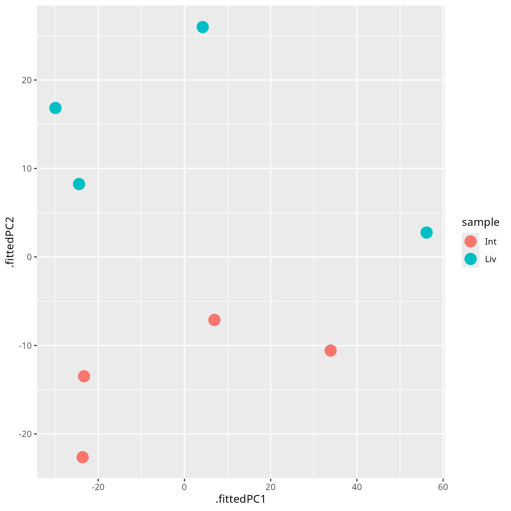
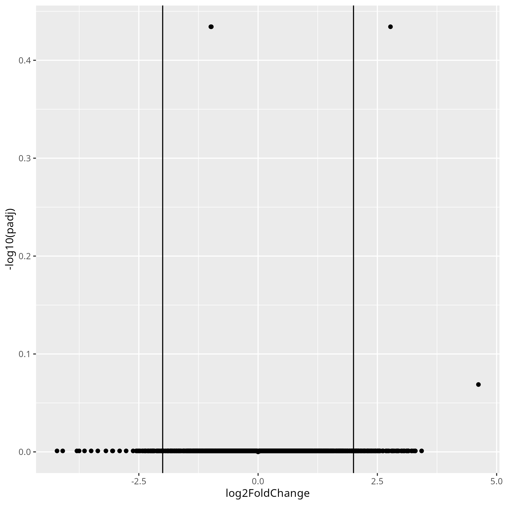
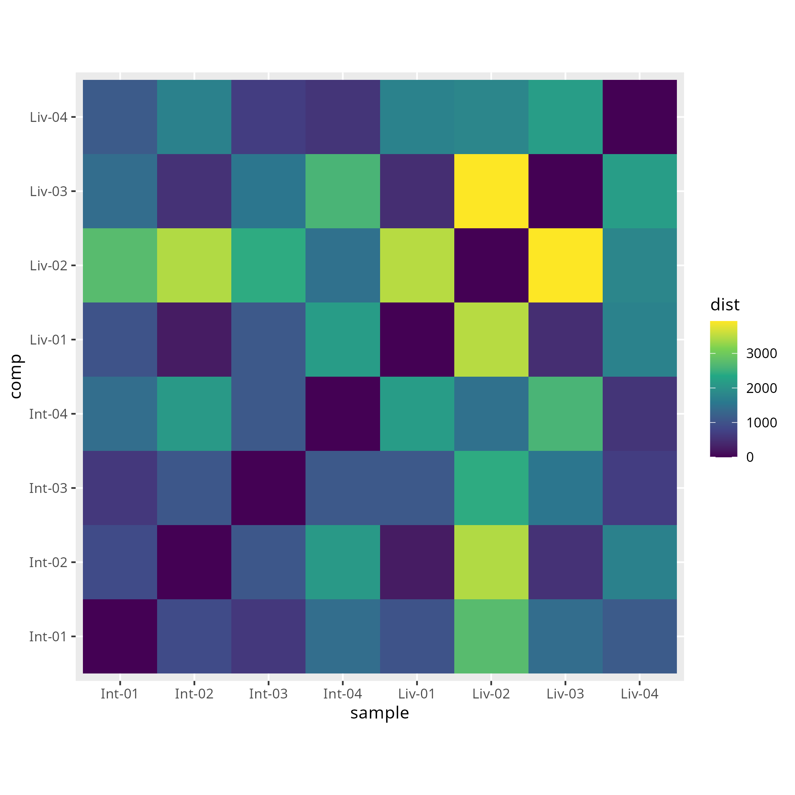

This is a distribution plot of our smaples from the hisat alignment before noramlization. There are not any clearly visable patterns.

This is a pca plot of our smaples from the hisat alignment before normalization. There is clear separation between the smaples from the liver and intestines. This leads me to believe that there is a signifficant different between miracidia from the liver and intestines.

